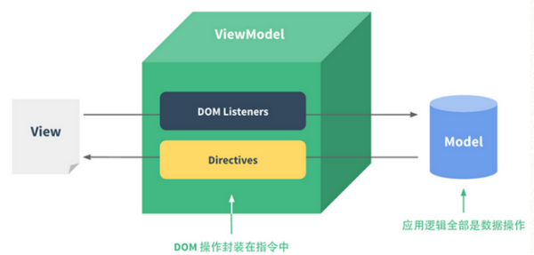

***vue.js框架的理解***
>注：只作为个人学习的一个记录，用于记录学习中遇到的问题和收获，监督自己每天进步学习新的东西。在此之前，工作项目中没有用到vue.js，所以打算自己先从官网简单的学习，做一个初步的了解，以后项目中用到上手容易点。

使用 Virtual DOM(这个理解不深，需要继续研究）
============================================
MVVM 数据绑定
============================================
   MVVM的本质是通过数据绑定链接View和Model，让数据的变化自动映射为视图的更新。Vue.js在数据绑定的API设计上借鉴了Angular的指令机制：用户可以通过具有特殊前缀的HTML 属性来实现数据绑定，也可以使用常见的花括号模板插值，或是在表单元素上使用双向绑定
```
   <!-- 指令 -->
    <span v-text="msg"></span>
    <!-- 插值 -->
    <span>{{msg}}</span>
    <!-- 双向绑定 -->
    <input v-model="msg">  
```


***vue.js简单语法***

*html 代码块*
```
<div id="app-1">
        <p>{{message}}</p>
</div>
```

*js 代码块*
```
var app1 = new Vue({
        el: '#app-1',
        data: {
            message: 'Hello Vue.js!'
        }
    });
```
